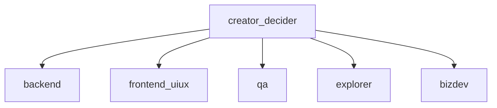

# Ants — 设计文档

本文档用于持续沉淀 Ants 的架构、协议、组织模型与运行规则。它不只是想法记录，而是后续实现的单一设计基线。

---

## 1. 产品定义

- **产品名**：`Ants`
- **核心形态**：多智能体协作系统；每个 Ant 是一个独立 Docker 容器。
- **技术栈**：全 Python，优先采用社区最主流、维护最稳定的方案，如 `FastAPI`、`Pydantic`、`Docker SDK for Python`、`PyYAML`。
- **对外能力**：系统只暴露一个对外接口，即状态接口。

---

## 2. 启动拓扑与角色

- **蚁后 (queen)**：根容器 = 二把手/老板；对应配置 `creator_decider`。接收**用户（老板的上级）**指令，拆解后下发给工人。
- **工人 (workers)**：`configs/agents/` 下除蚁后外的所有人；每个工人一个容器，**暴露 HTTP 接口**（`POST /aip`、`GET /status`）供蚁后、其他工人或用户调用。
- **用户**：老板的上级；通过蚁后暴露的接口（如 `POST /instruction`）下达指令。
- 整体关系是一个**有向图**，边从上级指向下级；工人不再建员。

### 2.1 默认组织图



### 2.2 启动规则（全员建员）

1. **蚁后**容器启动，读取 `creator_decider.yaml` 与 `configs/agents/` 下所有员工配置。
2. 若 `ANTS_AUTO_SPAWN_DEFAULT=1`（默认），蚁后为 **config 下除自己外的所有人** 各创建一个工人容器（全员建员）。
3. 若 `ANTS_AUTO_SPAWN_DEFAULT=0`，启动时不建员，可通过 `POST /internal/spawn` 动态创建。
4. 每个工人容器运行 HTTP 服务（端口 22001）+ 工具热加载；与蚁后同网（如 `ANTS_NETWORK`），蚁后通过 `http://ants-<agent_id>:22001` 调用。

### 2.3 用户指令流

- **用户（老板的上级）** → `POST /instruction`（请求体含 `instruction`）→ **蚁后**。
- 蚁后拆解任务后，通过 AIP 将子任务发到对应工人（如 `POST http://ants-backend:22001/aip`）。
- 工人执行后可通过接口上报或写留痕，蚁后聚合状态经 `GET /status` 对外暴露。

### 2.4 配置与运行时解耦 · 动态创建员工

- **员工配置**：仅作为模板，存放在 `configs/agents/*.yaml`。与“当前有哪些容器在跑”解耦。
- **蚁后 / 用户**：用户与蚁后交流后，可**动态创建员工**（`POST /internal/spawn`），按已有配置拉起新容器。
- **实现方式**：`GET /internal/configs` 列出 agent_id，`POST /internal/spawn` 创建容器；需 `X-Admin-Token`。新建岗位只需在 `configs/agents/` 增加 YAML。

---

## 3. 对外接口（仅两个）

系统与每个工人**只暴露两个接口**，便于全球部署与跨服务器工人对话时统一契约。

### 3.1 接口一：容器间对话（AIP）

- **路径**：`POST /aip`
- **语义**：接收一条 AIP 消息（同机或跨机）。请求体为 AIP 报文（from、to、action、payload 等）；接收方落盘到 `aip/messages.jsonl` 并返回 ack（message_id、status）。
- **蚁后**：接收 AIP 后，若 `to` 非自己则按 `to_base_url` 或本地 `ants-<to>:22001` 转发到该 ant 的 `/aip`；若 `to` 为自己则处理（如 `user_instruction` 拆解下发给工人）。
- **工人**：仅接收发往自己的 AIP（或 `to=*`），落盘并返回 ack。跨机时由调用方直接请求该工人对外暴露的 base URL（如 `https://worker-ant.example.com/aip`）。

### 3.2 接口二：自身工作信息 / 状态 / 进度

- **路径**：`GET /status`
- **语义**：返回本节点的工作信息、状态与进度；支持递归查询本节点及下级的总状态。
- **蚁后**：默认 `scope=colony` 返回整巢平铺聚合；支持 `scope=self` 与 `scope=subtree&root=<agent_id>`。
- **工人**：默认 `scope=self`；若该节点有下级，可通过 `scope=subtree` 返回“当前节点 + 下级”的递归总状态。

### 3.3 其他

- **蚁后**：`POST /instruction` 为便捷入口，等价于向蚁后发一条 `action=user_instruction` 的 AIP。
- **对内（需 Token）**：`GET /internal/configs`、`POST /internal/spawn`，仅管理用。
- **工人端口**：`22001`，仅集群内或通过 `status_api_base` 对外暴露时供跨机调用。
- **寻址**：请求时不需要额外在 body 中“带 IP”；调用方直接请求目标 URL。状态响应可返回 `base_url` 与 `endpoints` 以便发现下一跳地址。

---

## 4. 组织与员工模型

### 4.1 原则

- 每个人都可以作为管理者，只要其有下级。
- **蚁后**即 `creator_decider`，是全局根节点；用户 = 老板的上级。
- 组织关系在配置层显式声明。
- 扩岗时只需在 `configs/agents/` 新增 YAML。

### 4.2 员工参数模型

每个 Ant 都必须由一份标准配置描述。配置字段至少包含：

| 字段 | 含义 |
|------|------|
| `agent_id` | 全局唯一员工标识 |
| `display_name` | 展示名称 |
| `role` | 岗位角色 |
| `superior` | 上级 |
| `subordinates` | 下级列表 |
| `rank_level` | 级别 |
| `authority_weight` | 说话权与决策优先级 |
| `execution_scope` | 可执行范围 |
| `management_scope` | 可管理对象 |
| `skills` | 抽象能力集合 |
| `tools_allowed` | 具体工具白名单 |
| `prompt_profile` | 人设、系统规则、沟通风格 |
| `can_spawn_subordinates` | 是否允许创建下级 |
| `max_subordinates` | 最大直属下级数量 |
| `environment_policy` | 测试/正式环境策略 |
| `token_ref` | Token 引用 |
| `status_api_base` | 本 ant 对外 base URL（跨机时供他机/网关调用 `/aip`、`/status`） |
| `tags` | 扩展标签 |

### 4.3 默认岗位

| `agent_id` | `role` | 定位 |
|------|------|------|
| `creator_decider` | `creator_decider` | 架构、授权、指挥、拍板 |
| `backend` | `backend_engineer` | API、服务、数据契约 |
| `frontend_uiux` | `frontend_uiux` | UI、交互、可用性 |
| `qa` | `qa_engineer` | 测试、回归、发布门禁 |
| `explorer` | `explorer` | 方案探索、上下文研究 |
| `bizdev` | `bizdev` | 商业化、包装、价值表达 |

---

## 5. 技能与工具体系

Ants 将能力拆成两层：

- **skills**：抽象能力，如 `api_design`、`accessibility_review`、`commercialization`
- **tools_allowed**：具体工具，如 `openapi_checker`、`ui_inspector`、`pricing_canvas`

### 5.1 设计原则

- 技能决定一个岗位**应该会什么**
- 工具决定一个岗位**被允许调用什么**
- 工具可通过共享目录热加载
- 技能配置属于组织建模的一部分，不依赖热加载

### 5.2 热加载工具

- 共享目录：`/shared/tools`
- 运行方式：每个 Ant 在引导进程中扫描 `.py` 工具文件
- 行为：新增或变更工具文件后自动重载，不重启容器
- 治理：工具热加载记录必须写入留痕

---

## 6. AIP：Ants Interaction Protocol

AIP 是 Ants 的唯一正式通信规范。它必须同时满足：

- 同机通信
- 跨机通信
- 权限治理
- 审批控制
- 全量留痕

### 6.1 AIP 分层

- **协议层**：版本、收发方、路由范围、优先级、时间戳
- **治理层**：权威权重、审批状态、父任务链路
- **执行层**：动作、意图、载荷、输出要求、约束
- **可观测层**：重试次数、延迟、错误码、错误信息

### 6.2 AIP 标准字段

| 分类 | 字段 |
|------|------|
| 基础 | `version` `message_id` `correlation_id` `trace_id` `parent_task_id` |
| 路由 | `from` `to` `from_role` `to_role` `to_host` `to_base_url` `route_scope` |
| 执行 | `action` `intent` `payload` `expected_output` `constraints` |
| 治理 | `authority_weight` `requires_approval` `approval_state` |
| 运行 | `priority` `status` `retries` `latency_ms` |
| 诊断 | `error_code` `error_message` |
| 时间 | `created_at` `updated_at` |

### 6.3 标准动作

- `assign_task`
- `request_context`
- `request_artifact_review`
- `submit_report`
- `request_approval`
- `publish_status`
- `handoff`
- `escalate`
- `tool_result`
- `sync_skill_registry`
- `user_instruction`（用户指令，由蚁后接收并拆解下发）

### 6.4 治理规则

- 任何可能影响正式环境的消息都必须标记 `requires_approval=true`
- 在 `approval_state=approved` 前，不得执行正式环境动作
- 所有消息必须有可追溯的 `trace_id`
- 每条 AIP 消息必须写入留痕

### 6.5 同机与跨机（全球 / 多机房）

- **同机**：蚁后/工人通过 Docker 网络 `http://ants-<agent_id>:22001` 访问工人 `/aip`、`/status`。
- **跨机**：AIP 报文支持 `to_base_url`（目标 ant 的完整 base URL）。发送方或蚁后将该消息 `POST` 到 `{to_base_url}/aip` 即可；无需中心注册表，只要知道目标 ant 的公开 URL。
- **发现与路由**：配置中可为每个 ant 设置 `status_api_base`（如 `https://ant-backend.region.example.com`），蚁后转发时优先使用消息里的 `to_base_url`，否则用该 ant 的 `status_api_base`，再否则用同机默认 `http://ants-<to>:22001`。
- **鉴权**：跨机调用可在网关或目标服务前加 Token/API Key；协议层不强制，便于各地部署策略不同。

---

## 7. 测试环境与正式环境

这里的测试/正式，首先是**行为规则**，其次才是部署环境。

### 7.1 默认规则

- 所有协作产出优先落在测试环境
- 正式环境动作必须等待人类批准
- Ant 不得擅自把测试结果推向正式
- 该规则必须写入每个岗位的默认提示词与环境策略

### 7.2 配置表达

每个 Ant 的 `environment_policy` 应明确：

- 默认目标环境
- 是否允许测试环境自动执行
- 是否要求正式环境必须人审
- 审批模式

### 7.3 运行时配置（默认不含 Redis）

- **文件**：`configs/runtime.yaml`，供蚁后与工人共用。
- **默认内容**：`llm`（base_url、model_name、api_key）、`gitlab`（url、token）、`mysql`（host、port、user、password、database）。**默认不包含 Redis**；若某工人需要队列/缓存，可自行在该工人环境或侧车中部署 Redis，并在其 env 中配置。
- **敏感项**：使用占位符如 `${LLM_API_KEY}`，由环境变量在部署时注入。
- **注入**：蚁后启动时加载；建员时通过 `runtime_config_to_env()` 转为环境变量注入工人容器。

### 7.4 工人与容器执行（Docker-outside-of-Docker）

- **原则**：仅**蚁后**挂载 Docker Socket；工人容器不挂载。
- **工人需要跑容器时**（如跑测试、构建）：工人通过 AIP 或内部接口向蚁后发起请求（如 action `run_container`），蚁后用 Docker SDK 在宿主机起容器，将结果返回工人。
- **优点**：权限集中、安全、与“蚁后建员”一致。**不优先采用 DinD**；若有“工人即独立 CI runner”等需求再单独设计 DinD。

### 7.5 默认配置（高级默认）

- **runtime.yaml**：仅包含 llm、gitlab、mysql；注释说明 Redis 可由工人自建。适合全球多机房部署时各节点按需选配依赖。
- **agents/*.yaml**：每个岗位含 `environment_policy`（默认 test、正式需人审）、`prompt_profile`、`status_api_base`（可选，跨机时填写该 ant 对外 URL）。蚁后 `creator_decider` 为根，其余为工人模板；扩岗时复制并改 agent_id、role、skills、tools_allowed 即可。

---

## 8. 留痕与可观测性

每个 Ant 必须留下完整工作痕迹。最低要求如下：

| 类别 | 内容 |
|------|------|
| `workspace` | 工作区与产出 |
| `logs` | 运行日志、接口日志、热加载日志 |
| `conversations` | 对话记录 |
| `aip` | 收发 AIP 消息 |
| `todos` | 待办事项 |
| `reports` | 工作汇报 |
| `context` | 上下文快照与技能快照 |

### 8.1 状态聚合依赖

`/status` 不是实时读取内存，而是汇总：

- 配置中的组织图
- Docker 容器状态
- 留痕中的待办与错误
- 最近 AIP 记录
- 最近工作汇报

这样即使某个 Ant 已异常退出，也能通过留痕回放最近状态。

### 8.2 双存储：文件库 + 数据库

- **文件库**（当前 volumes 下各 ant 的 workspace、logs、conversations、aip、todos、reports、context）：作为**模型上下文的唯一数据源**。请求大模型时从文件读最近对话、AIP、待办、汇报、token 使用等，拼成 prompt，类似「问 AI 时从代码库拿」。
- **数据库**（MySQL）：同一份留痕**再写一份**到库表，用于查询、报表、审计、跨 ant 统计；不用于拼模型上下文。
- **双写**：写留痕时先落盘到文件，再异步或同步写入 DB；DB 不可用时仅写文件，不阻塞主流程。

### 8.3 工人工作流（接收 → 大模型 → 工具 → 对话 → 状态）

- 工人收到 AIP（如 `assign_task`）后：从**文件库**加载近期上下文（对话、AIP、待办、汇报）→ 拼系统提示（含岗位 skills、tools_allowed、环境策略）→ 若上下文过长（超过约 28k token 估计）则**主动压缩**：用一次 LLM 调用将中间对话归纳为「Previous context summary」，替换为一条 system 消息并可选写入 `conversations/summaries.jsonl`，再调大模型（带 tool_calling）→ 按需执行工具 → 将对话与结果写回文件库（并双写 DB）→ 更新待办/汇报 → 状态接口可汇总上述留痕。原始对话仍存于 messages.jsonl，压缩仅影响本次请求的上下文窗口，不改写历史。

---

## 9. 目录结构

当前建议目录结构如下：

```text
ants/
├── ants/
│   ├── agents/                 # Ant 引导与运行入口
│   ├── api/                    # 唯一对外状态接口
│   ├── protocol/               # AIP 协议模型
│   └── runtime/                # 配置、建员、状态聚合、留痕
├── configs/
│   ├── agents/                 # 岗位配置模板
│   └── runtime.yaml            # 运行时配置（LLM、GitLab、MySQL；Redis 可选、工人自建）
├── docs/
│   └── DESIGN.md
├── protocol/
│   └── aip.md                  # AIP 协议说明
├── shared/
│   ├── inbox/                  # 本地 AIP 投递入口
│   └── tools/                  # 热加载工具目录
├── volumes/
│   ├── creator_decider/
│   ├── backend/
│   ├── frontend_uiux/
│   ├── qa/
│   ├── explorer/
│   └── bizdev/
├── Dockerfile
├── pyproject.toml
└── README.md
```

### 9.1 单个 Ant 的 Volume 映射

每个容器内部统一使用固定路径：

| 容器内路径 | 用途 |
|------|------|
| `/workspace` | 工作区与产出 |
| `/logs` | 运行日志 |
| `/conversations` | 对话记录 |
| `/aip` | AIP 留痕 |
| `/todos` | 待办 |
| `/reports` | 汇报 |
| `/context` | 上下文快照 |
| `/shared/tools` | 热加载工具 |
| `/shared/inbox` | AIP 投递入口 |

---

## 10. 风险与建议

- 通过 Docker Socket 动态建员很直接，但权限偏大；后续上线建议替换成受控 Docker Proxy。
- 状态接口虽然只暴露一类信息，但内部留痕必须足够完整，否则排障能力不足。
- 岗位名不要写死在业务逻辑里，运行时代码应基于配置工作。
- 技能和工具要分层，避免把“会做什么”和“允许调用什么”混在一起。

---

## 11. 当前实现基线

- **对外仅两接口**：**(1) 容器间对话** `POST /aip`；(2) **工作信息/状态/进度** `GET /status`。
- **蚁后**：容器名 `ants-queen`，端口 `22000`；`GET /status`（聚合）、`POST /aip`（接收并转发/处理）；`POST /instruction` 为便捷入口（等价 AIP user_instruction）；启动时对 config 下除自己外**全员建员**。
- **工人**：每容器 `ants-<agent_id>`，端口 `22001`；仅 `POST /aip`、`GET /status`；command 为 `python -m ants.agents.server`。
- **运行时配置**：`configs/runtime.yaml`（默认 llm、gitlab、mysql，不含 Redis），建员时注入工人 env。
- **跨机**：AIP 支持 `to_base_url`；agent 配置支持 `status_api_base`；蚁后转发时优先 to_base_url → status_api_base → 同机 `http://ants-<to>:22001`。
- **Docker**：蚁后挂载 docker.sock；工人需跑容器时由蚁后代执行（Docker-outside-of-Docker）。
- AIP 为唯一正式协作协议。
